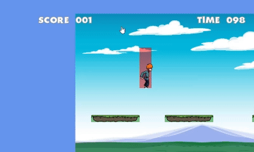

# ComputerGame

## Description 
Welcome to our Software Engineering Project. The goal of our project is to create a 2D computer game with .Net and the MonoGame-Framework.
In this game the player has the task of jumping from one platform to another platform in a specific time limit. The player earns points for each visited platform.
The game is lost when the time has run out or if the player falls of a platform.



## Installation

### All operating systems
1. Clone the game repository
	```
	git clone https://fbe-swenp1.hs-weingarten.de/Team14/swenp.Projekt1/_git/swenp.Projekt1
	```
2. Build the Project
3. Locate the output directory in the folder */ComputerGame/ComputerGame/bin/Debug/net6.0*
		
### Windows
4. Run the exe-File which is stored in the *bin* folder

### Linux and MacOS
4. Execute the following command in the command line
	```
	mono ComputerGame.exe
	```

## How to play the game
The game is a jump and run game with a time limit. The player has the task of jumping from one platform to another platform where the distance is calculated by a random number.
* The player can use the key *A* to walk left and *D* to walk right. 
* The player can press the *Shift* key as well as the *A* or *D* key to run left or right.
* The player can press the *Space* key to jump and the player can move left or right in the air if the left or right movement is active as well.

## Contribute
TODO: Explain how other users and developers can contribute to make your code better. 

If you want to learn more about creating good readme files then refer the following [guidelines](https://docs.microsoft.com/en-us/azure/devops/repos/git/create-a-readme?view=azure-devops). You can also seek inspiration from the below readme files:
- [ASP.NET Core](https://github.com/aspnet/Home)
- [Visual Studio Code](https://github.com/Microsoft/vscode)
- [Chakra Core](https://github.com/Microsoft/ChakraCore)

## Credits
* The used framework is the [MonoGame Framework](https://monogame.net/)
* The Wiki [RB Whitaker's Wiki](http://rbwhitaker.wikidot.com/monogame-getting-started-tutorials) was used for the introduction into the development of MonoGame projects

## Wiki
* Our Documentation of the game development is available in our [Wiki](/SWENP2324)